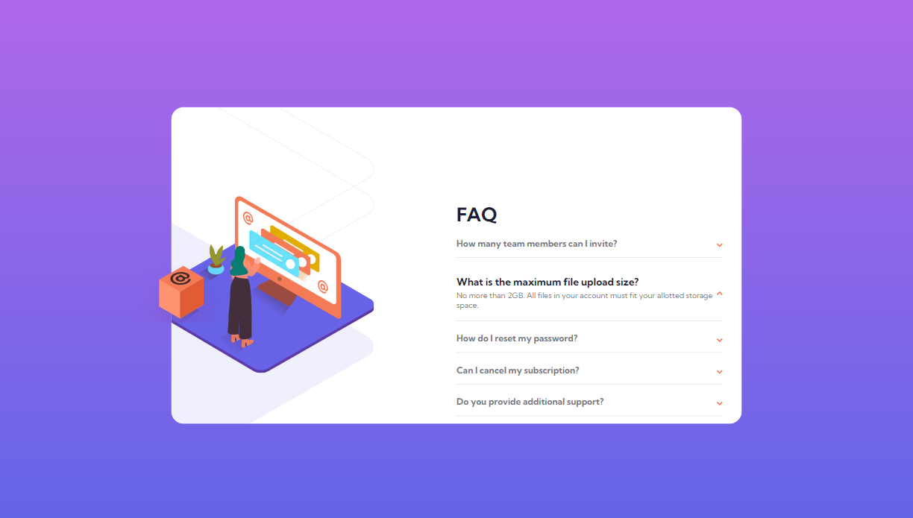

# FAQ Accordion Card

This is a simple FAQ accordion card built with ReactJS, HTML, and CSS. It allows users to expand and collapse questions and answers in a clean and user-friendly interface.

## Table of Contents
- [Features](#features)
- [Technologies Used](#technologies-used)
- [Screenshots](#screenshots)
- [Getting Started](#getting-started)
- [Customization](#customization)
- [Deployment](#deployment)
- [Credits](#credits)

## Features
- Responsive design
- Animated expand and collapse effect on the questions
- User-friendly interface
- Easy to customize and integrate into your project

## Technologies Used
- ReactJS
- HTML
- CSS

## Screenshots
|  |  |
| ------------------------------ | ----------------------------- |
| Desktop version                | Mobile version                |

## Getting Started
1. Clone or download the repository
2. Navigate to the project directory in your terminal
3. Run `npm install` to install the necessary dependencies
4. Run `npm start` to start the development server
5. The component will be available at http://localhost:3000

## Customization
The component can be easily customized by modifying the JSX code in the `src/components` directory and the CSS in the `src/styles` directory. The `map` function is used to loop through the questions and answers in the JSX.

## Deployment
To deploy the component to a live environment, run `npm run build` and use the files in the `build` directory.

You can see the live solution at: [https://hatemhenchir.github.io/faq-accordion-card](https://hatemhenchir.github.io/faq-accordion-card).

## Credits
Design inspiration and assets provided by [Frontend Mentor](https://www.frontendmentor.io/)
- My LinkedIn: [@hatem-henchir-7a92141a8](https://www.linkedin.com/in/hatem-henchir-7a92141a8/)
- My Frontend Mentor: [@hatemhenchir](https://www.frontendmentor.io/profile/hatemhenchir)
